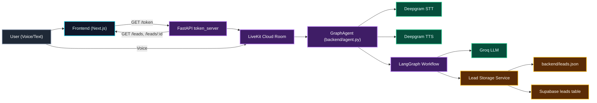
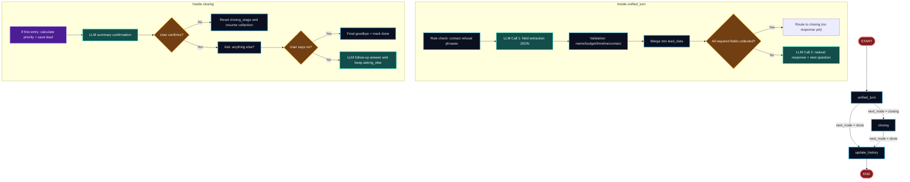
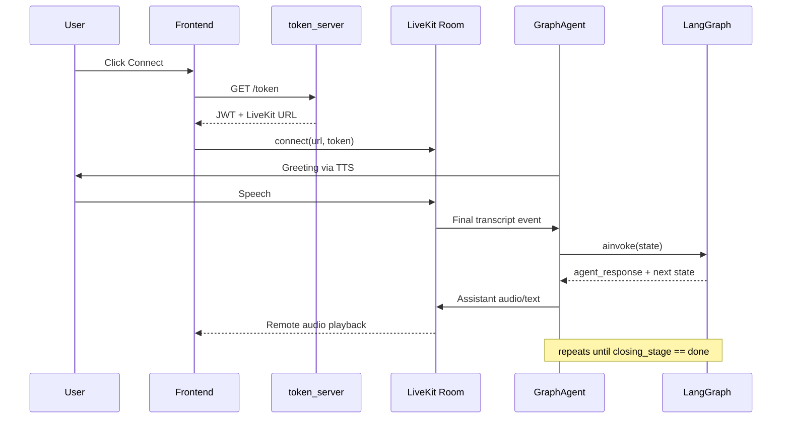
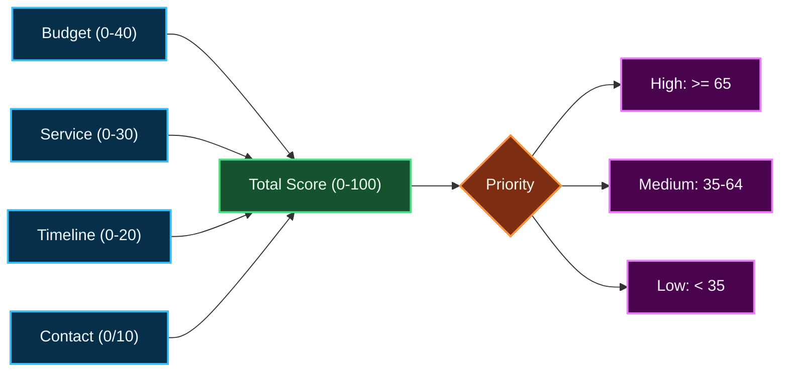

# Eera - AI Voice Lead Qualification System

Eera is a real-time voice sales assistant that captures, qualifies, and stores leads through natural conversation.

It combines LiveKit audio streaming, Deepgram STT/TTS, LangGraph state orchestration, Groq LLM reasoning, and a Next.js dashboard.

## What It Does
- Runs a live voice conversation with a prospect
- Extracts structured lead fields turn-by-turn
- Handles FAQs and follow-up questions naturally
- Scores priority from budget/service/timeline/contact completeness
- Persists leads to local JSON and Supabase
- Shows all captured leads in a dashboard with detail pages

## Tech Stack
- Backend: Python, LiveKit Agents, LangGraph, LangChain Groq, FastAPI, Supabase SDK
- Frontend: Next.js (App Router), React, livekit-client
- Realtime: Deepgram STT + TTS, Silero VAD
- LLM: Groq `llama-3.3-70b-versatile` (extraction + response generation)

## High-Level Architecture


## Agent Working (LangGraph Runtime)


## Voice Call Sequence (Realtime)


## Lead Scoring Model
- `budget` up to 40 points
- `service` up to 30 points
- `timeline` up to 20 points
- `contact present` 10 points



## API Endpoints
- `GET /token`: returns LiveKit access token + room data
- `GET /leads`: fetches leads (Supabase first, JSON fallback)
- `GET /leads/{lead_id}`: fetches single lead by ID
- `POST /chat`: text-based session chat using same LangGraph flow
- `DELETE /chat/{session_id}`: clears in-memory text session

## Project Structure
```text
voice-agent/
|-- backend/
|   |-- agent.py                     # Live voice GraphAgent worker
|   |-- token_server.py              # FastAPI API for token/leads/chat
|   |-- graph.py                     # LangGraph wiring
|   |-- state.py                     # Agent state TypedDict
|   |-- nodes/
|   |   |-- unified_turn.py          # Main conversational brain
|   |   |-- closing.py               # Confirmation + closure loop
|   |   |-- finalize_lead.py         # Scoring + priority logic
|   |   `-- ...
|   |-- services/
|   |   |-- llm.py                   # Groq model client
|   |   |-- lead_storage.py          # JSON + Supabase dual-write
|   |   `-- supabase_storage.py
|   `-- utils/lead_schema.py         # Lead schema + missing-field logic
|
`-- frontend/
    |-- src/app/page.tsx             # Voice call UI
    |-- src/app/leads/page.tsx       # Leads dashboard
    |-- src/app/leads/[id]/page.tsx  # Lead detail page
    `-- src/components/              # TopBar, VoiceOrb, EndCallButton, etc.
```

## Setup
### 1) Backend
```bash
cd backend
python -m venv venv
venv\Scripts\activate
pip install -r requirements.txt
copy .env.example .env
```

Start services:
```bash
python token_server.py
python agent.py dev
```

### 2) Frontend
```bash
cd frontend
npm install
npm run dev
```

Open `http://localhost:3000`.

## Environment Variables
Backend `.env`:
- `LIVEKIT_URL`
- `LIVEKIT_API_KEY`
- `LIVEKIT_API_SECRET`
- `GROQ_API_KEY`
- `DEEPGRAM_API_KEY`
- `SUPABASE_URL`
- `SUPABASE_KEY`

Frontend `.env.local`:
- `NEXT_PUBLIC_BACKEND_URL` (default `http://localhost:8000`)

## Notes
- Current LangGraph uses `unified_turn -> (closing|update_history)` as active path.
- Lead storage is fault-tolerant: JSON saves even if Supabase fails.
