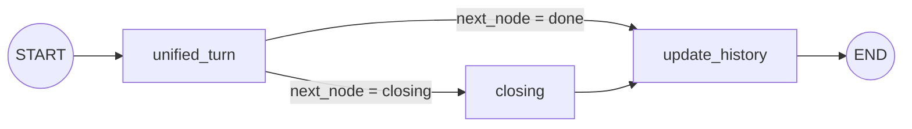
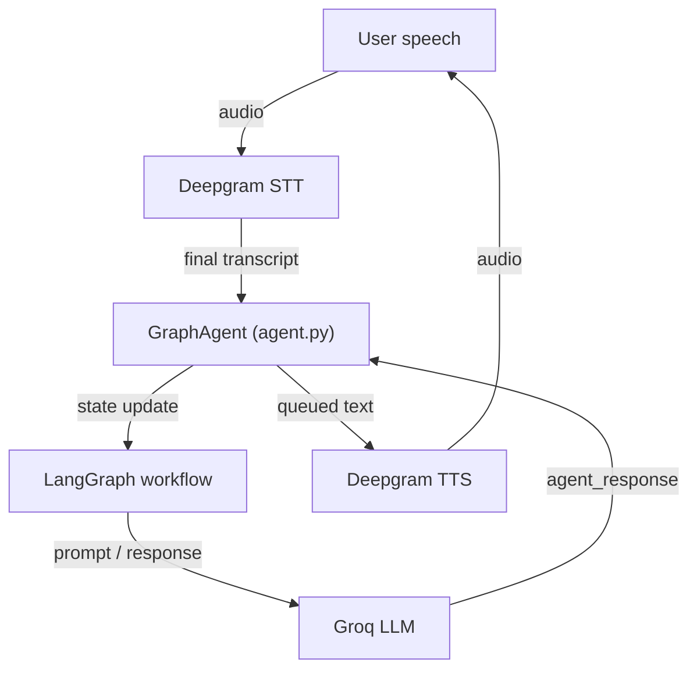

# Voice Agent

A voice-based sales lead capture agent built with LiveKit, LangGraph, Groq, and Deepgram.

The repository implements a real-time conversational agent that listens to a user on an audio call, extracts lead details, asks follow-up questions, confirms the lead, stores it in `leads.json`, and optionally generates LiveKit tokens for a frontend.

## What it does

- Receives speech from Deepgram STT
- Buffers partial transcripts and commits only final turns
- Routes each turn through a LangGraph state machine
- Uses a Groq-based LLM to extract lead details and generate spoken responses
- Handles a closing flow that confirms and saves leads
- Persists structured leads with a computed lead score
- Exposes a token server for LiveKit auth and lead retrieval

## Architecture

### Core runtime

- `agent.py`: main LiveKit agent subclass and real-time turn handler
- `graph.py`: builds the LangGraph state graph
- `state.py`: typed agent state definition
- `services/llm.py`: Groq LLM client initialization
- `services/lead_storage.py`: lead persistence and scoring
- `utils/lead_schema.py`: lead schema and missing-field helpers

### Active state graph



### Real-time voice flow



## Node responsibilities

### `nodes/unified_turn.py`

This is the main conversational coordinator.

- decides what lead fields are still missing
- constructs a prompt for the LLM
- extracts only explicitly stated fields from the latest user message
- asks one follow-up question at a time
- avoids re-asking already-collected fields
- changes route to closing once all lead fields are gathered

### `nodes/closing.py`

Handles the multi-stage closing flow:

- first entry saves the lead and generates a confirmation summary
- on confirmation, asks "anything else?"
- on denial, returns to collection
- on final no, says goodbye and marks `closing_stage = done`

### `nodes/update_history.py`

Appends the latest turn to `conversation_history` without mutating the old list.

## Additional node modules

The `nodes/` folder also contains alternate or experimental modules:

- `router.py` — intent-based routing logic
- `extract_lead.py` — structured extraction utility
- `update_lead.py` — merges extracted values into lead data
- `ask_question.py` — conversational question generation
- `answer_query.py` — handles general user questions
- `finalize_lead.py` — computes lead priority

These modules are present for alternative workflows and experimentation.

## Lead persistence

- `services/lead_storage.py` persists leads to `leads.json`
- each saved lead includes:
  - `captured_at`
  - `lead_score`
  - `name`, `company`, `service`, `budget`, `timeline`, `contact`, `priority`
- scoring is based on completeness and priority fields

## LiveKit token server

- `token_server.py` exposes a small FastAPI service
- Provides:
  - `/token` — issues LiveKit JWT tokens for a room
  - `/leads` — returns stored leads from `leads.json`

## Configuration

The project uses environment variables loaded from `.env`.

Required values:

- `LIVEKIT_URL`
- `LIVEKIT_API_KEY`
- `LIVEKIT_API_SECRET`
- `GROQ_API_KEY`
- `DEEPGRAM_API_KEY`

## Installation

```bash
python -m venv venv
venv\Scripts\activate
pip install -r requirements.txt
```

## Running the agent

The primary runtime entrypoint is the `entrypoint()` coroutine in `agent.py`. It is intended to be launched through LiveKit agent tooling.

The project is built around the LiveKit Agents API and expects a LiveKit room with:

- Deepgram STT for speech recognition
- Deepgram TTS for audio playback
- a Groq-based LLM for text generation
- optional Silero VAD for voice activity detection

## Running the token server

```bash
python token_server.py
```

Then visit `http://localhost:8000/token` to get a room token, or `http://localhost:8000/leads` to inspect saved leads.

## Notes

- `README.md` is generated from the repository layout and current runtime flow.
- `test.py` appears to reference a `services.stt` helper and is likely a local or older experiment.
- `leads.json` stores captured leads persistently and is created on first save.

## Dependencies

The main dependencies are listed in `requirements.txt`.

- `livekit`
- `livekit-agents`
- `livekit-plugins-groq`
- `langgraph`
- `langchain`, `langchain-core`, `langchain-groq`
- `groq`
- `python-dotenv`
- `pydantic`
- `aiohttp`

## Project layout

- `agent.py` — LiveKit agent implementation
- `graph.py` — language-graph workflow definition
- `config.py` — dotenv-backed configuration
- `state.py` — typed workflow state
- `nodes/` — modular workflow nodes
- `services/` — LLM and storage services
- `utils/` — lead schema and helpers
- `token_server.py` — token issuance and dashboard API
- `leads.json` — persisted captured leads
